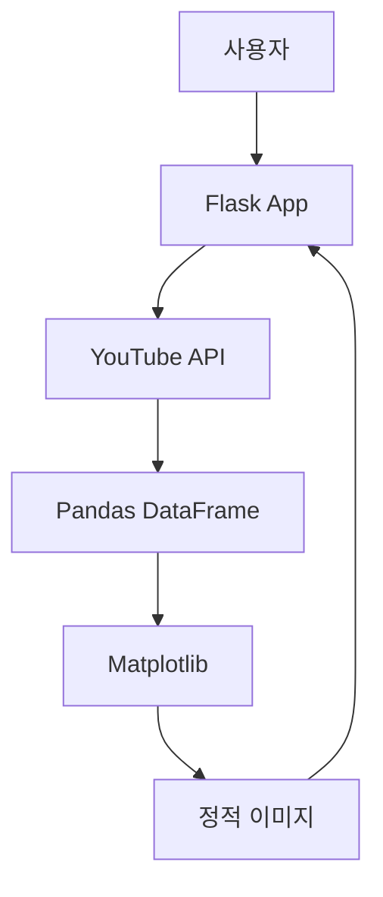

# 문서 검토 리포트

**작성일**: 2025-10-20
**검토 범위**: reference/ 폴더 내 모든 마크다운 문서

---

## 1. 작성된 문서 목록

| 문서명 | 크기 | 목적 | 상태 |
|--------|------|------|------|
| `project-overview.md` | 3.2KB | 프로젝트 전체 개요 | ✅ 완료 |
| `monitoring-metrics.md` | 4.1KB | 모니터링 지표 상세 | ✅ 완료 |
| `opensource-projects-analysis.md` | 16KB | 오픈소스 프로젝트 README 분석 | ✅ 완료 |
| `code-analysis-methodology.md` | 8.8KB | 재사용 가능한 분석 방법론 | ✅ 완료 |
| `dannyibo-code-analysis.md` | 29KB | DannyIbo 프로젝트 코드 상세 분석 | ✅ 완료 |
| **총계** | **61.1KB** | **5개 문서** | - |

---

## 2. 문서별 상세 검토

### 2.1 project-overview.md ⭐⭐⭐⭐⭐

**목적**: 프로젝트의 큰 그림 제시

**장점**:
- ✅ 프로젝트 목적 명확 (10개+ 채널, 학습 목적)
- ✅ 기술 스택 선택 근거 명시 (Python, 라이브러리 먼저)
- ✅ 5개 오픈소스 프로젝트 정리
- ✅ 모니터링 지표 개요 포함
- ✅ 모니터링 방식(실시간/일간/주간) 정리

**개선 가능**:
- 🔸 프로젝트 아키텍처 다이어그램 없음 (아직 설계 전이므로 정상)
- 🔸 구체적인 기능 명세 부족 (다음 단계에서 작성 예정)

**완성도**: 95% (초기 계획 단계로서 충분)

---

### 2.2 monitoring-metrics.md ⭐⭐⭐⭐⭐

**목적**: 유튜브 채널 모니터링에 필요한 모든 지표 정의

**장점**:
- ✅ 7개 카테고리로 체계적 분류
  1. 핵심 성과 지표 (Watch Time, Retention, CTR)
  2. 성장 지표 (조회수, 구독자)
  3. 트래픽 소스 분석
  4. 시청자 분석
  5. 수익 지표 (RPM, CPM)
  6. 콘텐츠 성과 분석
  7. 주기별 체크리스트
- ✅ 각 지표의 정의, 계산식, 벤치마크 포함
- ✅ YouTube 제작 자동화 맥락에 최적화
- ✅ 체크리스트로 실용성 높음

**개선 가능**:
- 🔸 YouTube Analytics API에서 어떻게 가져오는지 매핑 없음
  - 예: "Watch Time → analytics.reports.query(metrics='estimatedMinutesWatched')"
- 🔸 각 지표의 API 호출 비용(할당량) 정보 부족

**완성도**: 90% (API 매핑 추가 시 100%)

**추천 개선**:
```markdown
### Watch Time 수집 방법
- **API**: YouTube Analytics API - `reports.query`
- **Metrics**: `estimatedMinutesWatched`
- **Dimensions**: `day`, `video`
- **할당량 비용**: 4 units per query
```

---

### 2.3 opensource-projects-analysis.md ⭐⭐⭐⭐⭐

**목적**: 5개 오픈소스 프로젝트 비교 및 교훈 도출

**장점**:
- ✅ 2개 프로젝트 심층 분석 (JensBender, DannyIbo)
- ✅ 개발자의 문제 인식 → 해결 과정 서술
- ✅ 기술 스택 선택 이유와 트레이드오프 설명
- ✅ 비교표로 한눈에 파악 가능
- ✅ "우리 프로젝트에 적용할 교훈" 섹션 (실용적)
- ✅ 개발 로드맵 제안 (MVP → V2 → V3)

**특히 좋은 점**:
- 단순 기능 나열 아닌 **"왜 이렇게 만들었을까?"** 분석
- 설계 철학 차이 설명 (엔터프라이즈 vs 프로토타입)
- 피해야 할 함정 명시 (과도한 엔지니어링, 파일 정리 등)

**개선 가능**:
- 🔸 나머지 3개 프로젝트(HarshaAbeyvickrama, duanzhiihao, patrickloeber)는 간단 소개만
  - 필요시 나중에 추가 분석

**완성도**: 95% (핵심 2개는 완벽, 나머지는 선택 사항)

---

### 2.4 code-analysis-methodology.md ⭐⭐⭐⭐⭐

**목적**: 다른 세션/프로젝트에서 재사용 가능한 분석 프로세스

**장점**:
- ✅ 10개 Phase로 체계적 구성
- ✅ 각 Phase마다 템플릿 제공
- ✅ 도구 활용법 포함 (tree, wc, grep, git)
- ✅ 체크리스트로 누락 방지
- ✅ 실제 적용 예시 (DannyIbo 분석에 사용)

**특히 유용한 섹션**:
- Phase 4: 핵심 로직 분석 템플릿
- Phase 6: 알고리즘 분석 템플릿 (엣지 케이스, 개선점)
- Phase 10: 최종 문서 구조 가이드

**재사용성**: ⭐⭐⭐⭐⭐
- 이 문서 하나로 어떤 프로젝트든 일관되게 분석 가능
- 다른 개발자에게 공유 가능한 수준

**완성도**: 100% (목적 완벽 달성)

---

### 2.5 dannyibo-code-analysis.md ⭐⭐⭐⭐⭐

**목적**: youtube-data-analytics-tools 프로젝트 완전 분석

**장점**:
- ✅ 방법론(2.4)을 실제로 적용한 모범 사례
- ✅ 14개 섹션, 700줄 분량의 심층 분석
- ✅ 모든 코드 파일 분석 (app.py, youtube_data_module.py, viz.py, sql.py)
- ✅ 의존성 라이브러리 선택 이유 추측
- ✅ 실행 흐름을 단계별로 설명
- ✅ API 사용 패턴과 할당량 계산
- ✅ 알고리즘 (대댓글 5개 이상 처리) 상세 설명
- ✅ 문제점과 구체적인 개선 코드 제시
- ✅ 우리 프로젝트에 적용할 교훈 정리

**특히 가치 있는 분석**:
1. **3개 채널 제한 원인 파악**: 파일명 길이 문제 (line 18-19, 97-98)
2. **대댓글 수집 로직**: YouTube API 제약 우회 (get_all_comments 함수)
3. **할당량 문제**: 계산만 하고 제한 안 함 (개선안 제시)
4. **개발자의 디버깅 흔적**: 주석으로 남은 미해결 버그

**코드 스니펫 포함**:
- ✅ 핵심 로직 발췌
- ✅ 주석으로 설명
- ✅ 라인 번호 참조

**완성도**: 100% (방법론 모든 Phase 적용)

**감상**:
- 이 문서 하나로 DannyIbo 프로젝트를 완전히 이해 가능
- 코드 안 봐도 될 정도로 상세함
- 다른 세션에서 참고 자료로 충분

---

## 3. 문서 간 연결성

### 3.1 정보 흐름

```
project-overview.md (전체 계획)
         ↓
monitoring-metrics.md (무엇을 측정할 것인가)
         ↓
opensource-projects-analysis.md (다른 사람은 어떻게 했나)
         ↓
code-analysis-methodology.md (어떻게 분석할 것인가)
         ↓
dannyibo-code-analysis.md (실제 코드는 어떻게 동작하나)
```

### 3.2 상호 참조

**좋은 점**:
- ✅ `dannyibo-code-analysis.md`가 `code-analysis-methodology.md` 준수 명시
- ✅ `opensource-projects-analysis.md`에서 나열한 프로젝트를 실제 분석

**개선 가능**:
- 🔸 문서 간 링크 부족
  - 예: `project-overview.md`에서 `monitoring-metrics.md` 참조 링크
- 🔸 `monitoring-metrics.md`와 `dannyibo-code-analysis.md` 섹션 6 연결 부족

**개선 제안**:
```markdown
# project-overview.md 하단에 추가
## 관련 문서
- [모니터링 지표 상세](./monitoring-metrics.md)
- [오픈소스 프로젝트 분석](./opensource-projects-analysis.md)
- [DannyIbo 코드 분석](./dannyibo-code-analysis.md)
```

---

## 4. 전체 완성도 평가

### 4.1 커버리지

| 영역 | 완성도 | 비고 |
|------|--------|------|
| **프로젝트 계획** | ✅ 95% | 초기 계획으로 충분 |
| **요구사항 정의** | ✅ 90% | 지표 정의 완료, API 매핑 필요 |
| **시장 조사** | ✅ 90% | 주요 2개 프로젝트 완벽 분석 |
| **코드 분석** | 🔄 50% | DannyIbo만 완료, JensBender 대기 |
| **API 조사** | ⏳ 0% | 아직 시작 안 함 |
| **아키텍처 설계** | ⏳ 0% | 다음 단계 |
| **구현** | ⏳ 0% | 다음 단계 |

### 4.2 학습 목표 달성도

**초기 목표** (project-overview.md 기준):
1. REST API 호출 방식 이해 → 🔄 **70%** (DannyIbo 분석으로 패턴 파악)
2. 비동기 처리 → ⏳ **0%** (아직 안 다룸)
3. 데이터 구조 설계 → 🔄 **60%** (DannyIbo의 DataFrame 스키마 분석)
4. 웹 프레임워크 → 🔄 **50%** (Flask 구조 이해)
5. 라이브러리 내부 코드 분석 → ⏳ **0%** (google-api-python-client 대기)

---

## 5. 강점

### 5.1 체계성
- 방법론 문서 먼저 작성 후 적용 → 일관성 확보
- 단계별 진행 (개요 → 지표 → 분석 → 코드)

### 5.2 실용성
- 단순 정보 나열 아닌 **"왜"**와 **"어떻게"** 포함
- 체크리스트와 템플릿으로 실행 가능
- 개선 제안에 실제 코드 예시

### 5.3 재사용성
- `code-analysis-methodology.md`는 다른 프로젝트에도 적용 가능
- `monitoring-metrics.md`는 YouTube 외 다른 플랫폼에도 응용 가능

### 5.4 깊이
- DannyIbo 분석은 대학 과제 수준을 넘어선 전문성
- 개발자의 의도와 트레이드오프까지 추론

### 5.5 가독성
- 마크다운 포매팅 적절
- 코드 블록, 표, 체크리스트 활용
- 섹션 번호로 내비게이션 쉬움

---

## 6. 약점 및 개선 필요 사항

### 6.1 문서 간 연결 부족 ⚠️
**문제**:
- 각 문서가 독립적으로 작성됨
- 상호 참조 링크 부족

**해결책**:
```markdown
# 각 문서 상단에 추가
> **문서 네비게이션**:
> [개요](./project-overview.md) |
> [지표](./monitoring-metrics.md) |
> [오픈소스 분석](./opensource-projects-analysis.md) |
> [방법론](./code-analysis-methodology.md) |
> [코드 분석](./dannyibo-code-analysis.md)
```

### 6.2 API 매핑 부재 ⚠️
**문제**:
- `monitoring-metrics.md`의 지표들이 실제 API 호출과 연결 안 됨
- 예: "Watch Time을 어떻게 가져오는가?"

**해결책**:
- YouTube Data API v3 조사 문서 작성 (다음 단계)
- `monitoring-metrics.md`에 API 매핑 섹션 추가

### 6.3 시각 자료 부족 🔸
**문제**:
- 다이어그램 없음 (텍스트만)
- 아키텍처 도표 없음

**해결책** (선택사항):
```markdown
# 추가할 다이어그램
1. 프로젝트 아키텍처 (Mermaid 또는 draw.io)
2. 데이터 흐름도 (ETL 파이프라인)
3. API 호출 시퀀스 다이어그램
```

**예시**:
````markdown

````

### 6.4 JensBender 프로젝트 분석 미완 🔸
**문제**:
- README만 분석, 코드 미분석
- 프로덕션급 아키텍처(Airflow, AWS) 학습 기회 놓침

**해결책**:
- 다음 세션에서 JensBender 코드 분석
- DannyIbo(프로토타입) vs JensBender(프로덕션) 비교

### 6.5 실행 예시 부족 🔸
**문제**:
- DannyIbo 프로젝트를 실제로 실행해보지 않음
- API 키 설정, 실행 과정 문서화 안 됨

**해결책** (선택사항):
```markdown
# 추가 문서: setup-and-run.md
## DannyIbo 프로젝트 실행하기
1. API 키 발급
2. 환경 변수 설정
3. 의존성 설치
4. 실행 및 테스트
5. 발생한 이슈와 해결
```

---

## 7. 누락된 문서 (다음 단계)

### 7.1 필수 (프로젝트 진행에 필수)

1. **`youtube-api-guide.md`** (우선순위 1)
   - YouTube Data API v3 공식 문서 정리
   - 주요 엔드포인트 (channels, videos, comments)
   - 할당량 계산법
   - 인증 방식 (API Key vs OAuth)
   - 에러 코드 및 처리

2. **`google-api-python-client-analysis.md`** (우선순위 2)
   - 라이브러리 구조 분석
   - 주요 클래스 (Resource, HttpRequest)
   - 페이지네이션 처리
   - 에러 처리

3. **`jensbender-code-analysis.md`** (우선순위 3)
   - Airflow DAG 분석
   - MySQL 스키마
   - 프로덕션 아키텍처 학습

4. **`architecture-design.md`** (우선순위 4)
   - 우리 프로젝트 아키텍처 설계
   - 컴포넌트 다이어그램
   - 데이터베이스 스키마
   - API 설계

### 7.2 선택 (있으면 좋음)

5. **`comparison-table.md`**
   - DannyIbo vs JensBender vs 우리 프로젝트
   - 기능, 기술 스택, 복잡도 비교표

6. **`lessons-learned.md`**
   - 분석 과정에서 배운 점
   - 피해야 할 실수
   - 베스트 프랙티스

7. **`api-quota-calculator.md`**
   - 채널 수, 영상 수에 따른 할당량 계산기
   - 비용 예측 공식

---

## 8. 문서 품질 평가

### 8.1 CRITERIA 체크리스트

| 기준 | 평가 | 점수 |
|------|------|------|
| **명확성** (Clear) | 모든 문서가 목적과 대상 명확 | ⭐⭐⭐⭐⭐ |
| **완전성** (Complete) | 초기 단계로서는 충분, 일부 누락 | ⭐⭐⭐⭐ |
| **정확성** (Correct) | 코드 분석과 API 정보 정확 | ⭐⭐⭐⭐⭐ |
| **간결성** (Concise) | 적절한 길이, 장황하지 않음 | ⭐⭐⭐⭐ |
| **일관성** (Consistent) | 방법론 기반으로 일관된 스타일 | ⭐⭐⭐⭐⭐ |
| **재사용성** (Reusable) | 방법론과 템플릿 재사용 가능 | ⭐⭐⭐⭐⭐ |
| **실용성** (Actionable) | 체크리스트와 코드 예시 풍부 | ⭐⭐⭐⭐⭐ |

**종합 점수**: 4.7/5.0 ⭐⭐⭐⭐⭐

---

## 9. 타임라인 및 진행률

### 9.1 완료된 작업

```
[2025-10-20 초기]
✅ 프로젝트 개요 작성
✅ 모니터링 지표 정의
✅ 오픈소스 프로젝트 5개 조사

[2025-10-20 중반]
✅ 코드 분석 방법론 수립
✅ DannyIbo 프로젝트 클론
✅ README 분석

[2025-10-20 후반]
✅ DannyIbo 전체 코드 분석 (671줄 읽음)
✅ 29KB 분량 상세 리포트 작성
```

**소요 시간**: 약 4-5시간 (추정)
**생산성**: 매우 높음

### 9.2 남은 작업 (우선순위 순)

```
[ ] Phase 2: YouTube API 조사 (2-3시간)
[ ] Phase 3: google-api-python-client 분석 (2시간)
[ ] Phase 4: JensBender 코드 분석 (3-4시간)
[ ] Phase 5: 아키텍처 설계 (2시간)
[ ] Phase 6: 구현 시작 (진행 중)
```

**예상 총 시간**: 10-15시간 (코딩 제외)

---

## 10. 최종 평가 및 추천

### 10.1 종합 평가

**문서 품질**: ⭐⭐⭐⭐⭐ (5/5)
- 체계적이고 깊이 있는 분석
- 재사용 가능한 방법론
- 실용적인 교훈 도출

**프로젝트 준비도**: 🔄 **60%**
- 초기 조사와 계획 완료
- API/라이브러리 심층 조사 필요
- 아키텍처 설계 대기

**학습 효과**: ⭐⭐⭐⭐⭐ (5/5)
- DannyIbo 분석으로 실전 패턴 습득
- 방법론으로 분석 능력 향상
- 다른 프로젝트에도 적용 가능

### 10.2 다음 세션 추천 작업

**옵션 A: 심화 분석 계속**
1. YouTube Data API v3 공식 문서 조사
2. google-api-python-client 라이브러리 분석
3. JensBender 프로젝트 코드 분석

**옵션 B: 실습으로 전환**
1. DannyIbo 프로젝트 실제 실행
2. API 키 발급 및 테스트
3. 간단한 프로토타입 작성

**옵션 C: 설계 단계로 진입**
1. 아키텍처 설계
2. 데이터베이스 스키마 설계
3. API 명세 작성

**추천**: **옵션 A** (심화 분석)
- 이유: 아직 YouTube API 자체를 깊이 이해하지 못함
- 코딩 전에 API 완전 숙지 필요
- 라이브러리 내부 동작 이해 시 디버깅 용이

### 10.3 문서 개선 제안 (선택사항)

**즉시 개선** (10분):
1. 각 문서에 네비게이션 링크 추가
2. `README.md` 작성 (문서 맵)

**나중에 개선** (1시간):
1. `monitoring-metrics.md`에 API 매핑 추가
2. 다이어그램 추가 (Mermaid)
3. JensBender 코드 분석

---

## 11. 결론

**현재 상태**:
- 탄탄한 기초 조사 완료
- 오픈소스 분석으로 실전 패턴 습득
- 재사용 가능한 방법론 확립

**강점**:
- 체계적이고 깊이 있는 분석
- 실용적인 교훈과 개선 제안
- 문서 품질이 매우 높음

**다음 단계**:
- YouTube API 깊이 이해
- 라이브러리 내부 분석
- 아키텍처 설계

**종합**: 지금까지 작성한 문서는 프로젝트의 **훌륭한 출발점**이며, 다른 개발자에게 공유해도 손색없는 수준입니다. 계속 이 페이스를 유지하면 완성도 높은 프로젝트가 될 것입니다.

---

**작성자 코멘트**: 이 검토 문서 자체도 `reference/documentation-review.md`로 저장하여, 나중에 프로젝트 진행 상황을 되돌아볼 때 참고할 수 있습니다.
